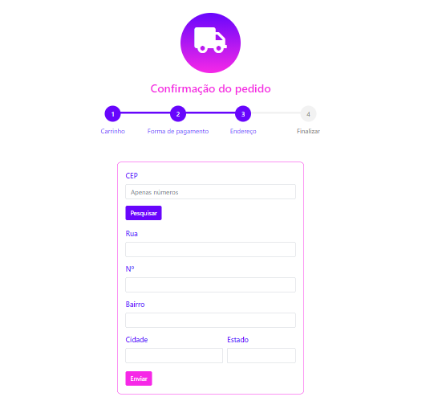

# Formulário baseado em entregas de produtos

Requisição http realizada na API do [ViaCEP](https://viacep.com.br/) para retornar, através do CEP informado: rua, bairro, cidade e estado.

## O que foi usado:
[Vue CLI](https://cli.vuejs.org/) (Vue.js)

[Axios](https://github.com/axios/axios)

[SweetAlert2 for Vue.js](https://www.npmjs.com/package/vue-sweetalert2)

## Como utilizar esse projeto:
1) Faça a clonagem desse repositório em sua máquina.
Para mais informações sobre essa etapa, [clique aqui](https://docs.github.com/pt/github/creating-cloning-and-archiving-repositories/cloning-a-repository).

2) Abra o repositório clonado via terminal.

3) Dentro do repositório clonado, execute:
> npm install 

ou
> yarn

Isso fará com que seja instalado todas as bibliotecas necessárias para executar o projeto.

4) Execute o projeto pelo terminal com o comando:
> yarn serve

 

   
